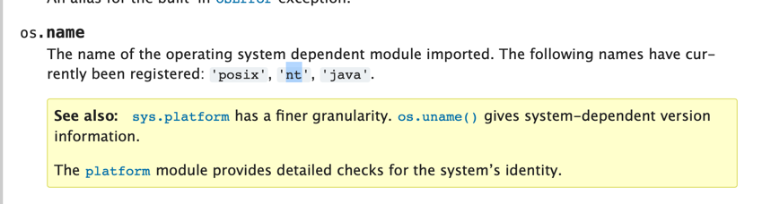

timeout :

```
try:
        while True:
            print("WD> Are you alive ?")
            connexion.send(bytes('Are you alive ?', 'UTF-8'))
            signal.signal(signal.SIGALRM, raiseTimeoutError)
            signal.alarm(3)
            try:
                connexion.recv(1024).decode('UTF-8')
            except TimeoutError:
                print("WD> Action timeout")
                connexion.send(bytes('EXIT', 'UTF-8'))
                raise ConnectionError
            finally:
                signal.signal(signal.SIGALRM, signal.SIG_IGN)
            time.sleep(2)
    except ConnectionError:
        print("Connexion with primary server aborted")
        freeCommunicationSystem(sharedMemoryName, pathTube1, pathTube2)
        activeChildren = terminateChildren()
        for child in activeChildren:
            child.join()
        sys.exit(" A failure might have occurred : Secondary server did not respond in time")
```

