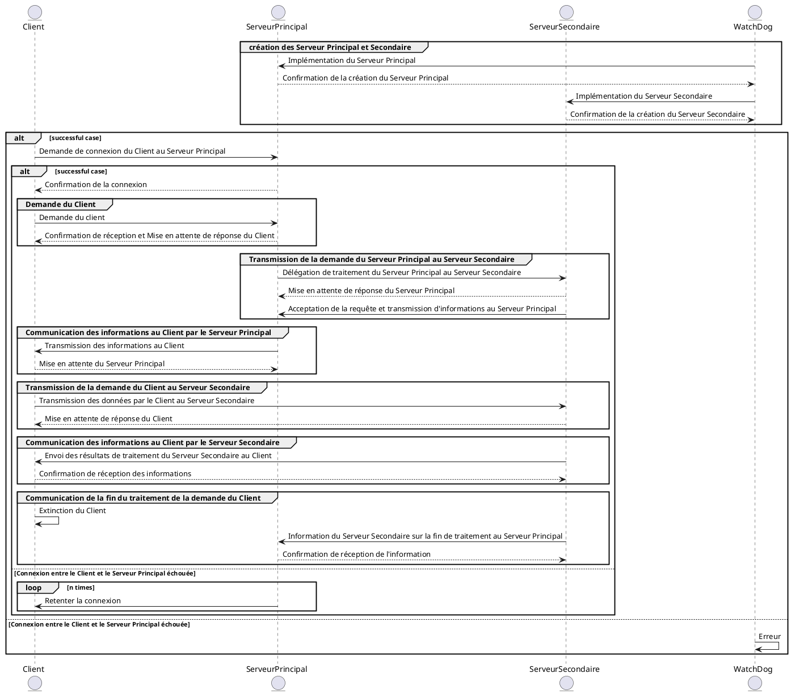

# secured_programming_project

```plantuml
@startuml
entity Client
entity ServeurPrincipal
entity ServeurSecondaire
entity WatchDog

group création des Serveur Principal et Secondaire
WatchDog -> ServeurPrincipal: Implémentation du Serveur Principal
ServeurPrincipal --> WatchDog: Confirmation de la création du Serveur Principal
WatchDog-> ServeurSecondaire: Implémentation du Serveur Secondaire
ServeurSecondaire --> WatchDog: Confirmation de la création du Serveur Secondaire
end

alt successful case

    Client -> ServeurPrincipal: Demande de connexion du Client au Serveur Principal

    alt successful case
        ServeurPrincipal --> Client: Confirmation de la connexion
    
        group Demande du Client
        Client -> ServeurPrincipal: Demande du client
        ServeurPrincipal --> Client: Confirmation de réception et Mise en attente de réponse du Client
        end

        group Transmission de la demande du Serveur Principal au Serveur Secondaire
        ServeurPrincipal -> ServeurSecondaire: Délégation de traitement du Serveur Principal au Serveur Secondaire
        ServeurSecondaire --> ServeurPrincipal: Mise en attente de réponse du Serveur Principal
        ServeurSecondaire -> ServeurPrincipal: Acceptation de la requête et transmission d'informations au Serveur Principal
        end

        group Communication des informations au Client par le Serveur Principal
        ServeurPrincipal -> Client: Transmission des informations au Client
        Client --> ServeurPrincipal: Mise en attente du Serveur Principal
        end

        group Transmission de la demande du Client au Serveur Secondaire
        Client -> ServeurSecondaire: Transmission des données par le Client au Serveur Secondaire
        ServeurSecondaire --> Client: Mise en attente de réponse du Client
        end

        group Communication des informations au Client par le Serveur Secondaire
        ServeurSecondaire -> Client: Envoi des résultats de traitement du Serveur Secondaire au Client
        Client--> ServeurSecondaire: Confirmation de réception des informations
        end

        group Communication de la fin du traitement de la demande du Client
        Client -> Client: Extinction du Client
        ServeurSecondaire -> ServeurPrincipal: Information du Serveur Secondaire sur la fin de traitement au Serveur Principal
        ServeurPrincipal --> ServeurSecondaire: Confirmation de réception de l'information
        end

    else Connexion entre le Client et le Serveur Principal échouée
        loop n times
            ServeurPrincipal -> Client: Retenter la connexion
        end
    end

else Connexion entre le Client et le Serveur Principal échouée
    WatchDog -> WatchDog: Erreur
end
@enduml
```