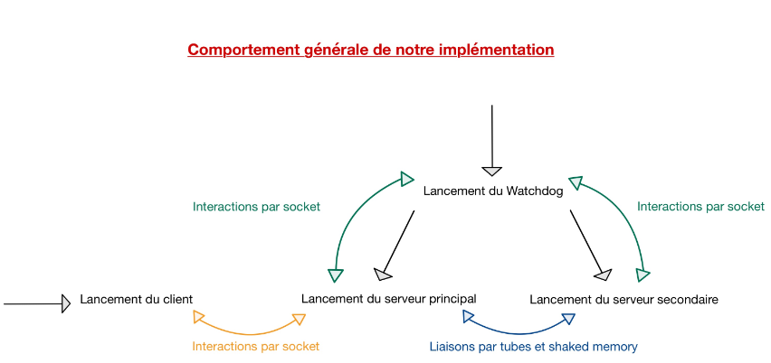
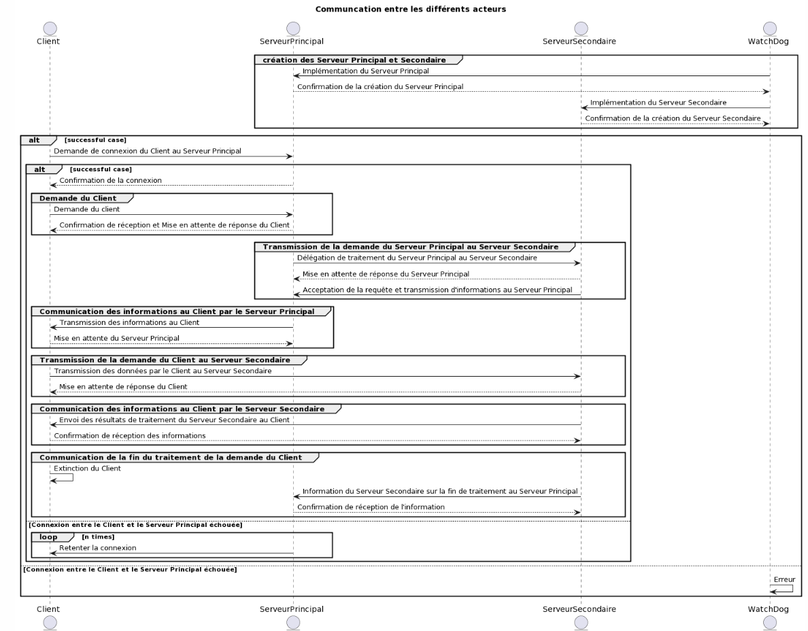
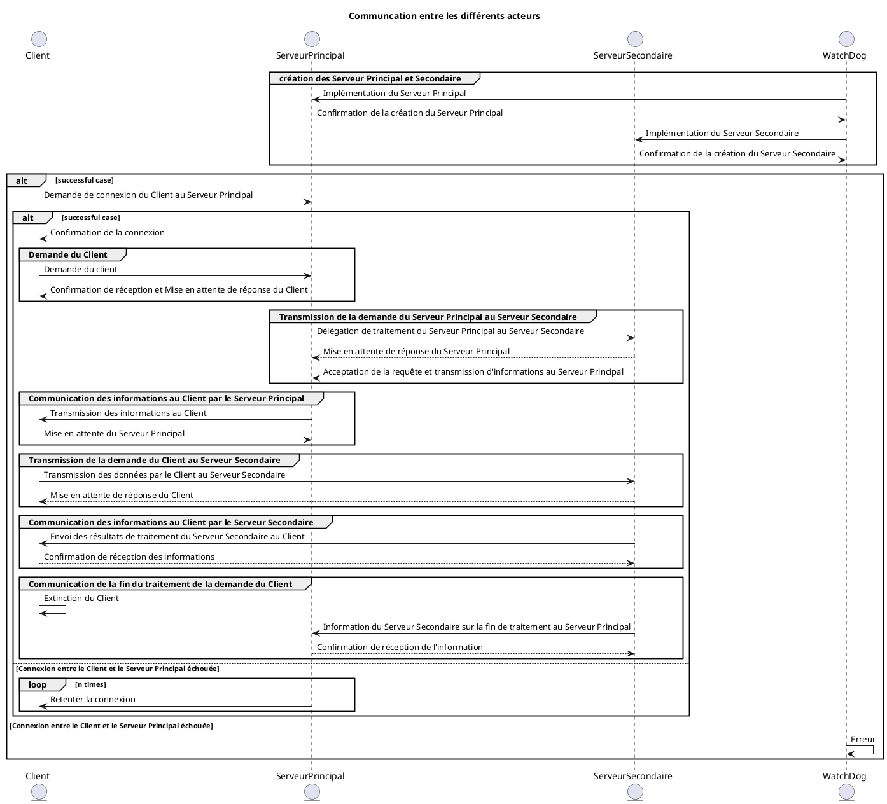

# Projet OSPS

---
## Équipe de travail

Carlier Amandine
Denorme William

FISA 4 Informatique

---
## Lancement du projet

Le projet est une application console qui peut être lancée **uniquement** sur Linux et en ligne de commande avec : 

    python3 ./launcher.py

Et 

    python3 ./client_launcher.py

L'initialisation des données et la mise en oeuvre de l'ensemble de la structure se fait place lors du début du lancement de l'application. En effet, lors du lancement nous allons créer automatiquement le WatchDog, ainsi que les deux serveurs (principal et secondaire).

Pour ce qui est de l'arrêt du projet, il s'arrête soit automatiquement si une anomalie est détectée par le Watchdog, soit quand tous les serveurs sont arrêtés de façon à stopper proprement l'esnemble des dispositifs réalisés.

Attention, pour que le projet se lance correctement, il est nécessaire d'utiliser la version 3.10 de python.

Aussi, si vous devez relancer plusieurs fois le projet, il se peut que des problèmes de ports se présentent. Ainsi, pour régler ce problème, il vous suffit de changer les ports se situant dans le fichier du watchdog, de même que dans le client et dans le serveur principal (ces deux derniers ports doivent être identiques). Nous ne savons hélas pas pourquoi ce problème se produit, car il arrive sous machine distante WSL et non sous MAC. Malgré notre acharnement, nous n'avons pas réussi à déceler d'où pouvait provenir ce problème.

---
## Spécificités présentes

Nous avons pour ce projet utilisé un large panel d'éléments vu durant le cours.

Effectivement, nous créons d'abord le Watchdog via notre launcher, puis nous implémentons notre serveur principal puis secondaire par le biais de se premier. Cela se fait par le système de fork que nous avons étudié.

De cette manière, le Watchdog pourra communiquer avec ses deux serveurs fils grâce à des sockets et les serveurs échangeront entre eux à travers de tubes nommées aevc connexion et de shared memory. Ces implémentations ont pu voir le au moyen des divers exemples mis à disposition dans le cours Moodle.

Par la suite, nous faisons intervenir un client, donc externe à notre modélisation, de manière à ce qu'il puisse envoyer et recevoir des informations du serveur principal. Ces échanges se font aux aussi par l'intermédiaire de socket.

Naturellement, nous avons essayé de mettre en place un minimum de sécurtité au sein de notre réalisation, que ce soit par la mise en place d'exceptions particulières ou pas la gestion de retours de certaines fonctions.

---
## Difficultés rencontrées

### Gestion des différents projets

La première difficulté a été la gestion des projets en parallèle entraîné par le changement de contexte technique et fonctionnel. En effet nous avons, ce semestre, de nombreux projets ayant des contextes techniques différents (des langages de programmation) et des contextes fonctionnels différents également (c'est-à-dire des sujets de travail différents). 

Ainsi, ils nous a fallu conjuguer l'ensemble de ces travaux dans le peu de temps qu'il nous a été consacré.

### Définition et ordonnancement des tâches

La seconde difficulté découle de la première. Effectivement, en plus de devoir organiser nos différents projets, nous avons dû organiser nos tâches au sein de celui-ci. Ce manque d'organisation au début du projet nous a malheureusement coûté du temps.

Afin de pouvoir optimiser notre temps, nous avons mis en place une maquette manuscrite représentant la modélisation de notre projet. Au-delà de cette organisation, nous avons essayé de définir l'ensemble des choses à réaliser afin d'éviter de trop nous éparpiller et d'avancer petit à petit dans ce projet conséquent. Celles-ci nous ont permis de définir une ligne directrice dans l'ordonnancement des tâches à effectuer.

Aussi, nous avons eu la chance aujourd'hui d'avoir eu un accompagnement au cours de tous les TP, ce qui n'est malheureusement pas toujours le cas au travers de nos différents modules.

### Difficultés techniques

Il est vrai que tout au long de ce projet, nous avons rencontré un certains nombre de peau de banane :-)

La première difficulté a été de bien comprendre le sujet et ce qui nous a été demandé car nous n'avons malheureusement pas eu beaucoup l'occasion de réaliser ce type de projet.git 

Ensuite, une fois cela compris, nous avons pu facilement lancer les divers exemples présent sur Moodle et comprendre ce qu'ils faisaient. Nous nous sommes intéresser à partir de là, à la mutualisation des systèmes d'échanges en commençant par la mise en oeuvre des tubes et des shared memory. Ces tubes ont, comme attendu, eu raison de nous pendant plusieurs heures puisque la communication entre nos deux serveurs (via ses tubes) ne se faisait de la manière escomptée. Toutefois, la mise en place des shared memory n'a pas posé trop de problème, si ce n'est la non suppression de cette dernière, nous obligeant de le faire manuellement lorsque le programme ne s'arrête pas de manière propre.

Vient alors la réalisation des interactions par socket. Ici encore, nous avons rencontré différents obstacles, tel que la non surveillance simultanée des serveurs principal et secondaire par le watchdog. Pour essayer de contrer cela, nous avons implémenté des threads, threads qui n'a pas été simple à gérer au vu du nombre important de communication en même temps.

Aussi, comme attendu, nous avons eu aussi des problèmes avec la commande "execlp". En effet, une erreur de libération du segment mémoire survient, par conséquent nous avons fait le choi de supprimer cette commande. Malheureusement, nous avons manqué de temps pour revenir sur cette erreur".

De plus, lors de la mise en place du client, nous avons rencontré des problèmes au niveau de la transmission d'informations dans la shared memory. En effet, une fois qu'une chaîne de caractères était mise dans la shared memory, il était impossible de la comparer avec une autre chaîne de caractères classique, sûrement suite à un changement que nous ne voyons pas.

---
## Diagramme de séquence

### En image

### Code plantuml

